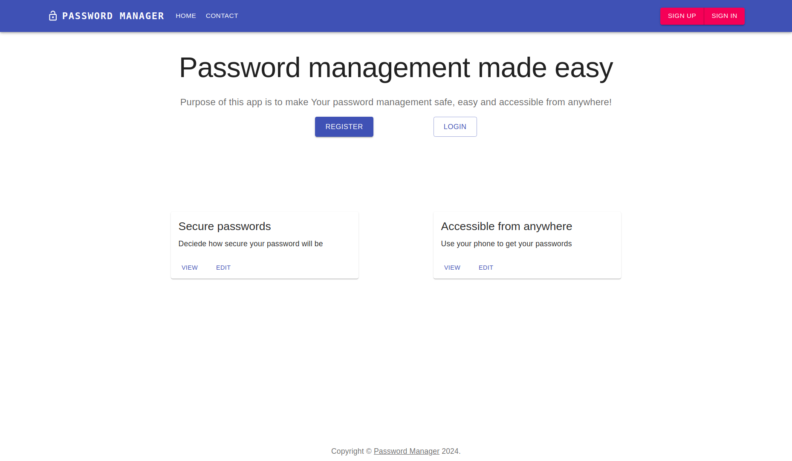
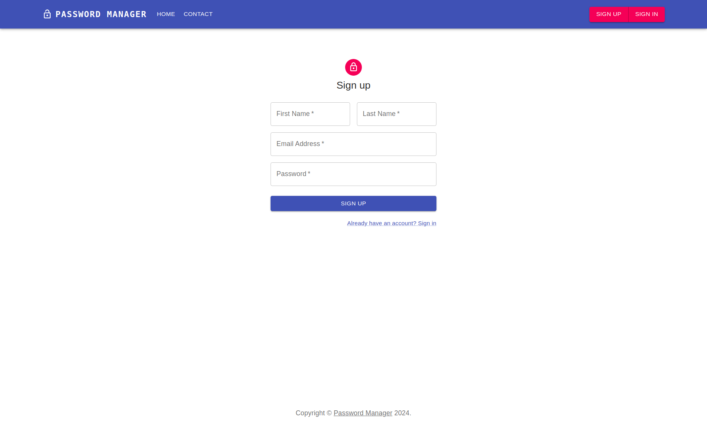
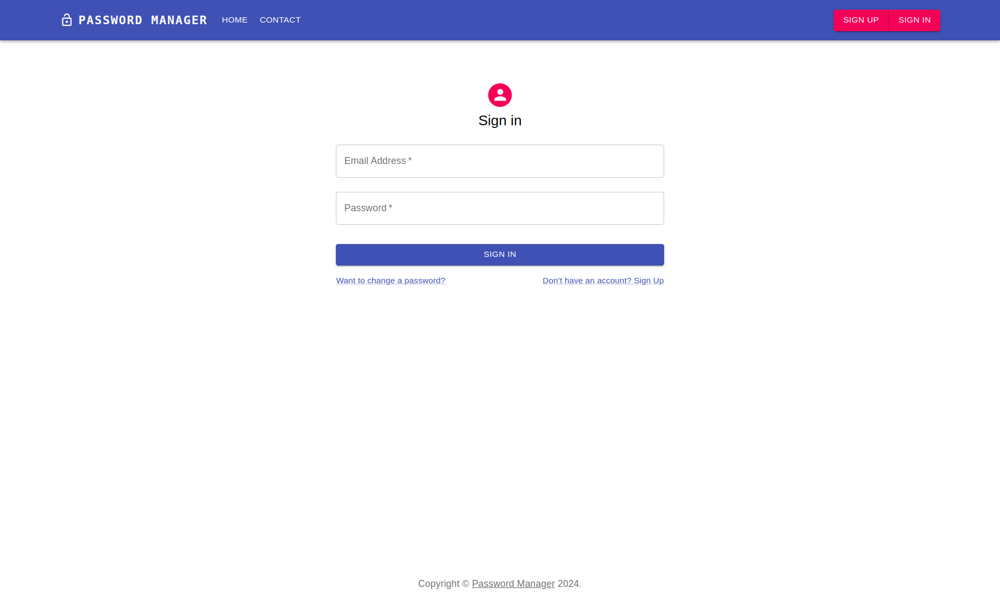
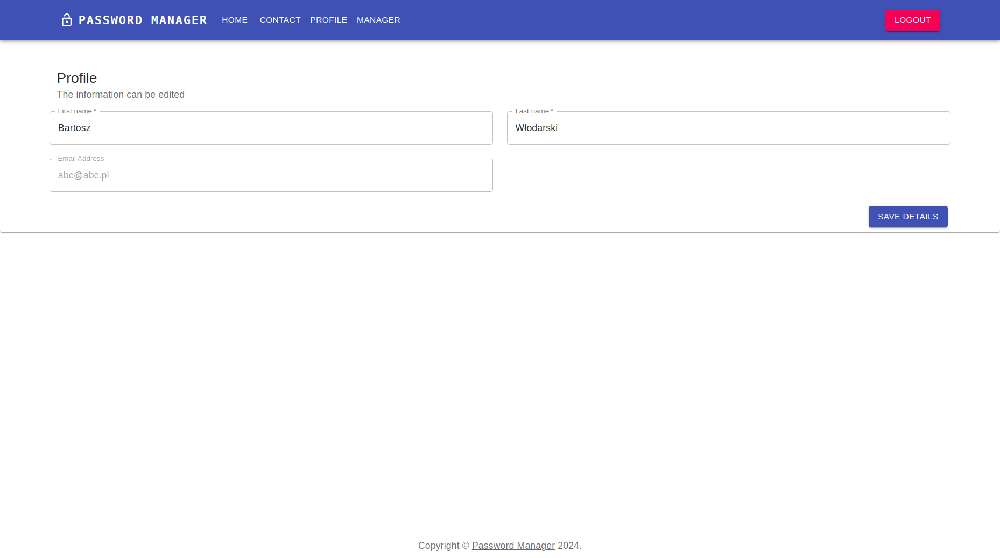
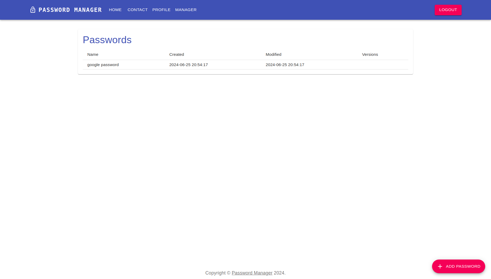
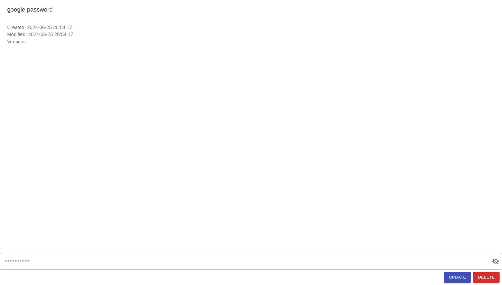
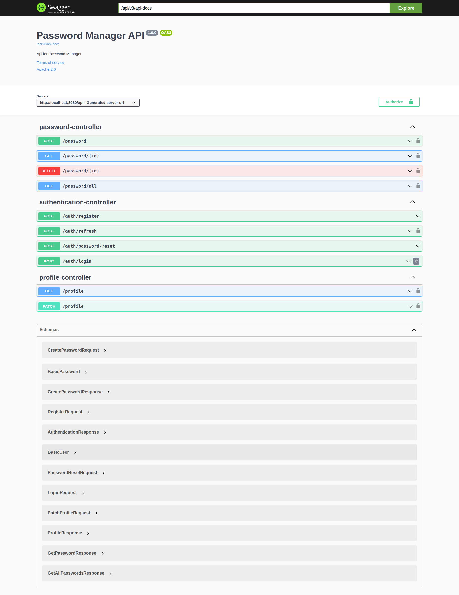

<div align="center">
  <h1 align="center">Password Manager</h1>
</div>
<p align="center">
    <a></a>
    <a></a>
    <a></a>
    <a></a>
</p>

<p align="center">
    <a href="https://github.com/barto14753/password-manager/actions/workflows/api-ci.yml"></a>
    <a href="https://github.com/barto14753/password-manager/actions/workflows/frontend-ci.yml"></a>
</p>

Password manager contains of:
* React web application
* Spring backend application
* PostgreSQL database 

## Setup
Run docker-compose to create setup
```bash
docker-compose up
```

## App

### Frontend
Frontend is a React application that allows user to manage passwords. It is connected to backend application.








### Backend
Backend is a Spring application that provides REST API for frontend application. It is connected to PostgreSQL database.

